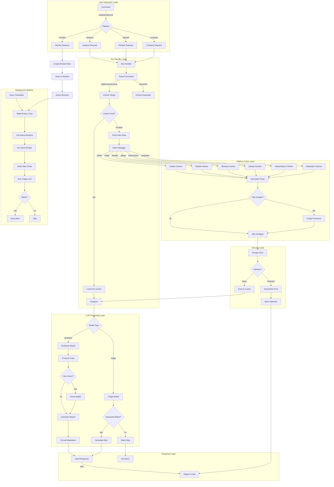

# OSINT Relay - Low Level Process Flow

## Data Flow Description

### 1. Command Entry
- User sends command via Telegram (`/analyze`) or Discord (`?analyze`)
- Bot handler receives and parses the command
- Extracts platform, username, and optional query/keywords

### 2. Cache Check
- Check if target data exists in `data/cache/`
- Verify cache freshness (24-hour TTL by default)
- If fresh: load and proceed to analysis
- If stale/missing: fetch new data

### 3. Data Fetching
- Client Manager routes to appropriate platform fetcher
- Fetcher calls platform API (with rate limiting)
- Posts normalized to `NormalizedPost` format
- Images downloaded to `data/media/`

### 4. Security Processing
- User-Generated Content (UGC) wrapped in XML tags
- All content XML-escaped to prevent injection
- Pattern scan for prompt injection attempts
- Injected content quarantined, operator warned
- Clean content saved to cache

### 5. LLM Analysis
- **Triage Mode** (monitoring): Fast/cheap model evaluates keyword matches
- **Synthesis Mode** (analysis): Heavy model generates full report
- Vision model analyzes images if present
- Results formatted as Markdown

### 6. Response Delivery
- Report/alert sent back to chat platform
- For monitoring: only alerts on keyword matches
- For analysis: full intelligence report

### 7. Background Watcher
- Runs on `asyncio` loop every `OSINT_WATCH_INTERVAL_SECONDS` (default: 300s)
- Iterates through active monitoring rules from `data/sessions/`
- Fetches only new posts (after last check timestamp)
- Uses triage model to evaluate keyword matches
- Sends alerts to user's chat on matches
- Silent on no-match to reduce noise

## Key Files Involved

- `bot.py` - Main daemon entrypoint
- `telegram_handler.py` / `discord_handler.py` - Chat interface
- `watcher.py` - Background scheduler
- `analyzer.py` - Analysis orchestration
- `llm.py` - LLM client with router pattern
- `client_manager.py` - Platform client factory
- `platforms/*.py` - Per-platform fetchers
- `cache.py` - File-based cache manager
- `session_manager.py` - Session & monitor persistence
- `image_processor.py` - Image download & preprocessing
